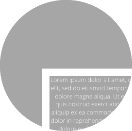
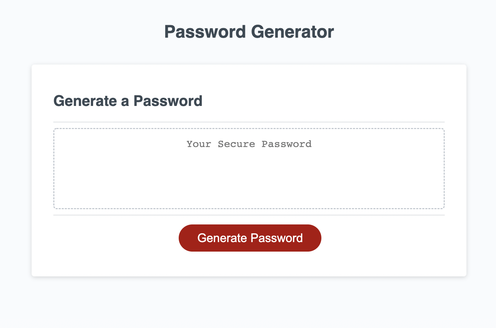

  

<h1 align="center">Password Generator</h1>

## Decription

With online accounts it is a safe practice to use a different password for each account. If a user has many accounts it can be difficult to get creative with passwords after a while. This generator will give a unique and diifferent password each time the "generate password" button is clicked.

## Built With

- HTML
- CSS
- JavaScript

## Website

<a href="https://nicolebarranca.github.io/Password-Generator-Nb/">Password Generator</a>

</a>

## Questions

Feel free to contact me directly at nikkibarranca@gmail.com if you have any questions about the repo. You can find more of my work at [Nicole Barranca](https://github.com/NicoleBarranca).
